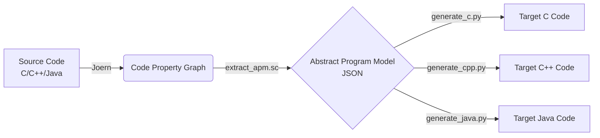

# CPG-Based Code Translation Framework

This module acts as Phase 2 of the Multi-Language Code Similarity Framework. It leverages the language-agnostic properties of Joern's Code Property Graph (CPG) to accurately translate structural logic and algorithms among C, C++, and Java at the CS-1 level.

## 🚀 Quick Start

To translate a single C file to Java:
```bash
# Translates array sum from C to Java
bash translation/run_translation.sh data/cross/p1/ref/ref1_c.c java translation/test_output
```
The output will be placed inside `translation/test_output/`, including `ref1_c_apm.json` (the intermediate representation) and `ref1_c_generated.java` (the compilable code).

To verify the semantic equivalence of a translation by comparing stdout:
```bash
python3 translation/verify_translation.py \
  --source data/cross/p1/ref/ref1_c.c \
  --generated translation/test_output/ref1_c_generated.java \
  --target-lang java
```

To run a batch translation across all datasets and directions:
```bash
bash translation/run_all_translations.sh
```

## 🏗️ Architecture

The pipeline processes code via a **Language-Neutral Intermediate Representation (APM)**:



1. **APM Extraction**: A Joern Scala script `extract_apm.sc` traverses the source CPG. It intelligently detects variable scopes, parameter roles (e.g. `ARRAY_SIZE`), reconstructs operator expressions, and flattens language-specific I/O constructs into universal APM structures.
2. **Abstract Program Model (APM)**: A strict, language-neutral JSON specification dictating statements (e.g., `FOR_LOOP`, `ASSIGN`) and expressions (e.g., `BINARY_OP`, `ARRAY_ACCESS`). See `translation/apm_schema.json` for the full spec.
3. **Cross-Language Mapping**: `translation/type_map.json` and `translation/io_map.json` inject specific target-language types (e.g. `long long` in C++ to `long` in Java) and I/O formatters (`std::cout` vs `printf`).
4. **Target Code Generation**: Python scripts subclassing `codegen_base.py` read the APM graph and emit syntactically sound, indented target source code.

## ⚙️ Supported Constructs (CS-1)

| Category | Constructs | Notes |
|---|---|---|
| **Control Flow** | `for`, `while`, `do-while`, `if/else`, `return`, `break`, `continue` | Nested structures fully supported. |
| **Logic/Operators** | Arithmetic, Relational, Logical AND/OR/NOT, Pre/Post Increment | Full precedence preservation via AST reconstruction. |
| **Data Types** | `int`, `long`, `double`, `float`, `char`, `bool`/`boolean`, `void`, 1D Arrays | Explicit mappings applied according to target languages. |
| **Array Sizing** | Implicit (`arr.length`) ↔ Explicit (`int n`) | Automatically detects and injects/removes array size parameters as appropriate across languages. |
| **I/O** | `printf`/`scanf`, `std::cout`/`cin`, `System.out.println` | Handles basic format string conversion and types. |

## ⚠️ Known Limitations
- Not designed for object-oriented programming translation (classes, inheritance, polymorphism).
- No support for template metaprogramming or pointers/memory management beyond standard 1D array iterations.
- External non-standard library dependencies are ignored.

## 📊 Verification Result Summary
The framework verifies accuracy explicitly using a robust testing orchestration protocol located in `verify_translation.py`, which validates translated code via native compiler verification (`gcc`/`g++`/`javac`) and deterministic output matching.
