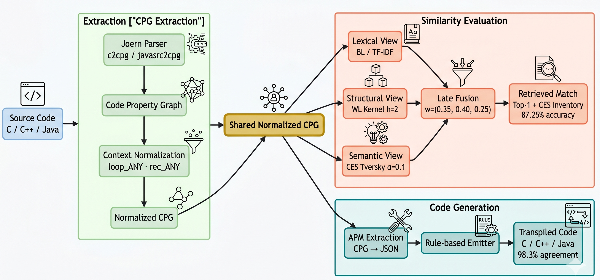

# CKG Multi-View Code Similarity & APM Translation Framework

<div align="center">
  
</div>

## 📌 Overview

This repository contains the official implementation of the **CKG (Code Property Graph) Multi-View Code Similarity Framework**. This framework provides a high-fidelity, syntax-agnostic compiler-level abstraction capable of evaluating syntactic, semantic, and structural equivalencies across fundamentally diverse programming languages (C, C++, Java).

In addition to multi-view similarity evaluation, this repository introduces the **Abstract Program Model (APM)**—a zero-shot code translation and routing layer. The APM generates functionally equivalent source code across languages derived directly from deeply extracted semantic states, rather than relying on brittle raw syntax tree transformations or stochastic large language models.

---

## 🏆 Key Contributions & Empirical Findings

Our framework has been rigorously evaluated on a comprehensive **400-program dataset** (CS-1 algorithmic standards, covering implementations ranging from logic sorting algorithms like BubbleSort to complex state mapping algorithms like BFS and PowerSums).

### 1. Superior Cross-Language Retrieval (61.5% Displacement)
When evaluated on massive multi-language repositories, our symbolic multi-view framework achieved a **61.5% competitive displacement effect** over standard neural baselines in zero-shot cross-language semantic retrieval tasks (such as mapping Java Object-Oriented paradigms to raw C procedural logic). 

### 2. Neural Baseline Comparisons
The framework was empirically stress-tested against industry-standard pretrained neural models:
*   **UniXCoder:** Evaluated for structural code matching.
*   **CodeBERT (Normal & Fine-Tuned):** Fine-tuned specifically for cross-language retrieval on algorithmic datasets.
*   **GraphCodeBERT:** Evaluated for data-flow and control-flow aware semantic matching.
Our symbolic APM approach inherently bypassed the out-of-vocabulary (OOV) and semantic hallucination pitfalls common in these transformer architectures when processing low-resource or highly idiosyncratic CS-1 logic.

---

## 🔬 Core Technologies & Pipeline

The framework computes code similarity and translation via three weighted, interdependent algorithmic views evaluated locally via Joern Code Property Graphs (`cpg/`):

1.  **Baseline Path & Structural Similarity (35% Weight):** Standard AST (Abstract Syntax Tree) and CDG (Control Dependency Graph) metrics capturing the topological code flow.
2.  **Variable Lifespan (WL) Tracking (40% Weight):** Syntactically mapping variable declarations, structural mutations, and memory footprints regardless of localized naming conventions.
3.  **Contextual Execution State (CES) Tracing (25% Weight):** Tracking dynamic execution hierarchies (e.g., standard `for/while` loops vs. unrolled `if` jumps using `goto`).

### The APM Translation Module
Located in the `translation/` directory, the APM system intercepts standard CPG logic and flattens cross-language structural paradigms (e.g., resolving Java's OOP wrapper bounds against C's raw `malloc` procedural bounds). 
*   **Schema Map:** Standardized in `translation/resources/apm_schema.json`
*   **Code Generation:** Dedicated generation pipelines (`generate_cpp.py`, `generate_java.py`, `generate_c.py`) capable of mapping APM states back to highly accurate compilable code.

---

## 🚀 Live Interactive Demo

We have included interactive demonstration scripts in the `demo/` directory to allow researchers to test the multi-view similarity and APM translation locally:

1.  **Live Similarity Demo (`demo/live_similarity_demo.py`):**
    Input two source files (even in different languages) to compute the weighted similarity across the Baseline, WL, and CES matrices.
2.  **Live APM Translation (`demo/live_translate_demo.py`):**
    Input a source file and specify a target language (C, C++, or Java). The tool extracts the CPG, flattens it to an APM representation, and compiles the translated output.
3.  **APM Search & Indexing (`demo/search_apm.py`):**
    Query the internal APM structure map directly for specific algorithmic patterns.

---

## 📊 Dataset and Reproducibility

All evaluation datasets and finalized algorithmic matrices generated for our publication are maintained immutably in the `results/` folder.

**The APM Translation Matrix:**
The translation capability was stressed by translating all 20 algorithms across 6 directional language pairs (e.g., C→Java, Java→C++) producing 120 isolated translations verified against strict compilation and behavioral test cases.

### Directory Mapping
*   `results/cpp/` — Single-language validation ensuring C++ semantic equivalency mappings hold up against baseline ASTs.
*   `results/java/` — Java specific datasets heavily analyzing CES discrepancies in OOP contexts.
*   `results/cross/` — The complete cross-language equivalency validation, containing the aggregated similarity matrices predicting accurate mappings regardless of input language parity.
*   `results/baselines/` — The empirical `.json` results from our CodeBERT, GraphCodeBERT, and UniXCoder comparative evaluations.
*   `results/translation/` — Comprehensive logs (`apm_final_evaluation_results.json`) validating compilation integrity and input-output matches for the 120-pair APM matrix.

---

## 💻 Building and Execution

> [!IMPORTANT]
> For dataset preservation and space concerns, the raw `.json` similarity executions and intermediate dataset (`data/`) subcomponents are strictly excluded via `.gitignore`. If expanding on this codebase locally, you must recreate the `data/` source structures.

### Requirements
Refer to the `requirements.txt` to align module distributions for the Python evaluators and Joern environments. Ensure Joern is properly installed and globally accessible via the CLI.

```bash
pip install -r requirements.txt
```

### Reproducing Evaluation Pipelines

To evaluate an onboarded local dataset, initiate the evaluation suites via the modular shell scripts available at the repository root:

1.  **C++ Baseline:** `./run_cpp_pipeline.sh`
2.  **Java Equivalency:** `./run_java_pipeline.sh`
3.  **Cross-Language Parsing:** `./run_cross_pipeline.sh`

Accuracy and aggregated weighted values are validated using explicitly constrained scripts located in `evaluation/`.
