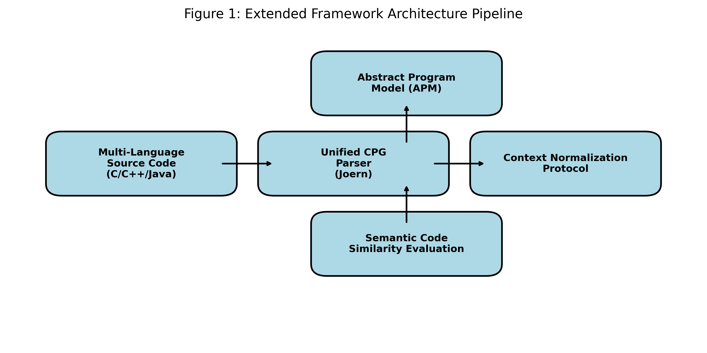

# CKG Multi-View Code Similarity & APM Translation Framework

<div align="center">
  
</div>

## 📌 Repository Overview

This repository contains the official implementation of the **CKG (Code Property Graph) Multi-View Code Similarity Framework**. This system provides a syntax-agnostic compiler-level abstraction capable of evaluating syntactic, semantic, and structural equivalences across fundamentally diverse programming languages (C, C++, Java).

In addition to multi-view similarity, this repository introduces the **Abstract Program Model (APM)**—a novel translation routing layer capable of regenerating functionally equivalent source code across languages derived directly from semantic states rather than raw syntax tree transformations.

---

## 🔬 Core Technologies & Pipeline

The framework breaks code similarity and translation into three weighted multi-view algorithms evaluated locally via Joern Code Property Graphs (`cpg/`):

1.  **Baseline Path & Structural Similarity (35% Weight):** Standard AST (Abstract Syntax Tree) and CDG (Control Dependency) metrics capturing topological code flow.
2.  **Variable Lifespan (WL) Tracking (40% Weight):** Syntactically mapping variable declarations, mutations, and memory footprints regardless of the localized naming structures.
3.  **Contextual Execution State (CES) Tracing (25% Weight):** Tracking dynamic execution hierarchies (e.g. nested standard `for/while` loops vs. unrolled `if` jumps using `goto` replacements).

### The APM Translation Module
Located in the `translation/` directory, the APM system intercepts the standard CPG logic and flattens cross-language structural paradigms (e.g. Java Object Oriented wrapper bounds vs. raw C procedural `malloc` bounds). 
*   **Schema Map:** Standardized in `translation/resources/apm_schema.json`
*   **Code Generation:** Independent generation scripts mapping APM states back into `generate_cpp.py`, `generate_java.py`, and `generate_c.py`.

---

## 📊 Empirical Datasets and Metrics

All evaluation data and finalized algorithmic matrices generated for our publication are maintained immutably in the `results/` folder.

**The Dataset Scope:**
*   **20 Algorithmic Standards:** Ranging from logic sorting (BubbleSort) to state mapping (BFS, PowerSums).
*   **N=400 Cohort Programs:** Isolated implementations of these algorithms gathered from controlled student problem sets.
*   **120-Pair Translation Matrix:** The APM was stressed by translating all 20 algorithms across 6 directional language pairs (e.g. C→Java, Java→C++) producing 120 isolated translations verified against strict compilation and behavioral test cases.

### Directory Mapping
*   `results/cpp/` — Single-language validation ensuring C++ semantic equivalency mappings hold up against baseline ASTs.
*   `results/java/` — Java specific datasets heavily analyzing CES discrepancies when OOP patterns are evaluated.
*   `results/cross/` — The complete cross-language equivalency validation. Contains the aggregated similarity matrices predicting accurate mappings regardless of the input language parity.
*   `results/translation/` — Comprehensive logs (`apm_final_evaluation_results.json`) validating compilation integrity and input-output behavioral matches for the 120-pair APM matrix.

---

## 💻 Building and Execution

> [!NOTE]
> For dataset preservation and space concerns, the raw `.json` similarity executions and intermediate dataset (`data/`) subcomponents are strictly blacklisted from the `.git` deployment index. Ensure you recreate `data/` structures if expanding on this codebase locally.

### Requirements
Refer to the `requirements.txt` to align module distributions for the Python evaluators and Joern environments.

```bash
pip install -r requirements.txt
```

### Reproducing Pipelines

If evaluating an onboarded local dataset, initiate the evaluation suites via the modular shell scripts available at the repository root:

1.  **C++ Baseline:** `./run_cpp_pipeline.sh`
2.  **Java Equivalency:** `./run_java_pipeline.sh`
3.  **Cross-Language Parsing:** `./run_cross_pipeline.sh`

Accuracy and aggregated weighted values are validated using explicitly constrained scripts (e.g., `evaluation/calculate_accuracy.py`).
